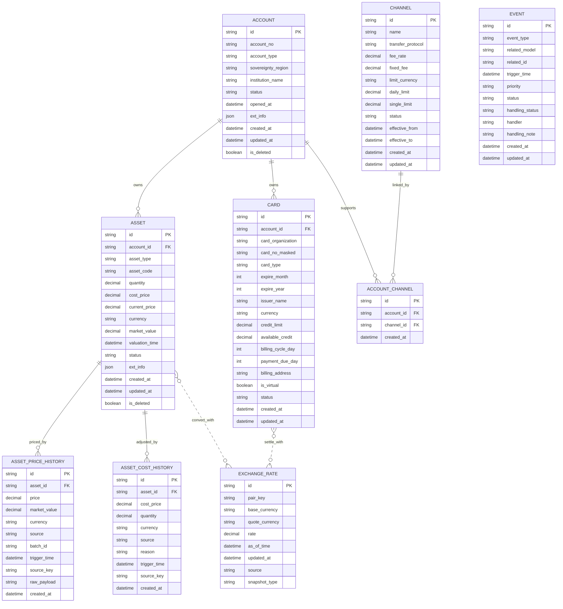

# GWP ER 图

## 1. 说明

本文件仅用于展示 GWP 核心数据模型的实体关系图。

## 2. Mermaid ER 图

## 3. 关系说明

- ACCOUNT -> ASSET: 一对多
- ACCOUNT -> CARD: 一对多
- ACCOUNT <-> CHANNEL: 通过 ACCOUNT_CHANNEL 多对多关联；路由规划以 Account.id 为节点，在同通道成员间生成双向边
- ASSET -> ASSET_PRICE_HISTORY: 一对多；每次成功估值写入一条快照，承接资产价格走势与 Dashboard 趋势
- ASSET -> ASSET_COST_HISTORY: 一对多；用户手动调整 cost_price / quantity 时写入一条审计记录
- EXCHANGE_RATE: 独立汇率服务，被资产估值和卡结算调用
- EVENT: 跨模型通用事件记录（操作型告警：失败、到期、同步过期等），**不再承载成功估值**
