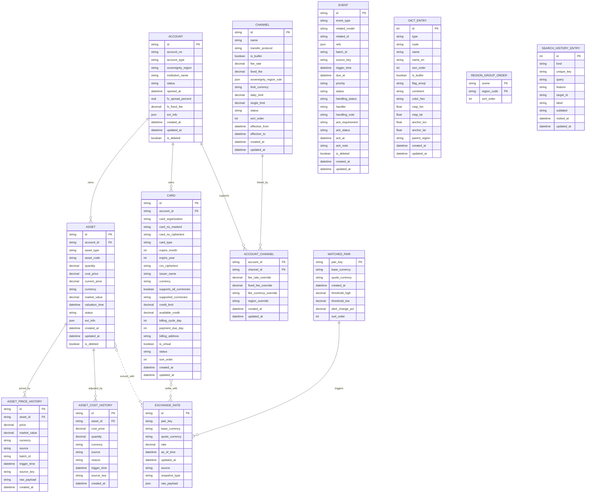

# Coffer ER 图

## 1. 说明

本文件仅用于展示 Coffer 核心数据模型的实体关系图。

## 2. Mermaid ER 图

## 3. 关系说明

- ACCOUNT -> ASSET: 一对多
- ACCOUNT -> CARD: 一对多
- ACCOUNT <-> CHANNEL: 通过 ACCOUNT_CHANNEL 多对多关联；路由规划以 `(accountId, currency)` 为扩展状态空间，在同通道成员间生成双向边；ACCOUNT_CHANNEL 承载账户级的费用覆盖与运行时地区覆盖
- ASSET -> ASSET_PRICE_HISTORY: 一对多；每次成功估值写入一条快照，承接资产价格走势与 Dashboard 趋势
- ASSET -> ASSET_COST_HISTORY: 一对多；用户手动调整 cost_price / quantity 时写入一条审计记录
- EXCHANGE_RATE: 独立汇率服务，被资产估值、卡结算、多币种路径规划（FX 换汇边权重）调用
- EVENT: 跨模型通用事件记录（操作型告警：失败、到期、同步过期等），**不再承载成功估值**
- WATCHED_PAIR: 用户关注的币对，触发汇率告警的阈值管理
- DICT_ENTRY: 字典表（转账协议 / 主权地区 / 货币），`is_builtin` 标记内置项
- REGION_GROUP_ORDER: 用户自定义地区分组排序，按 scene 分场景，独立于业务实体
- SEARCH_HISTORY_ENTRY: 全局搜索历史，`unique_key` 幂等去重，独立于业务实体
